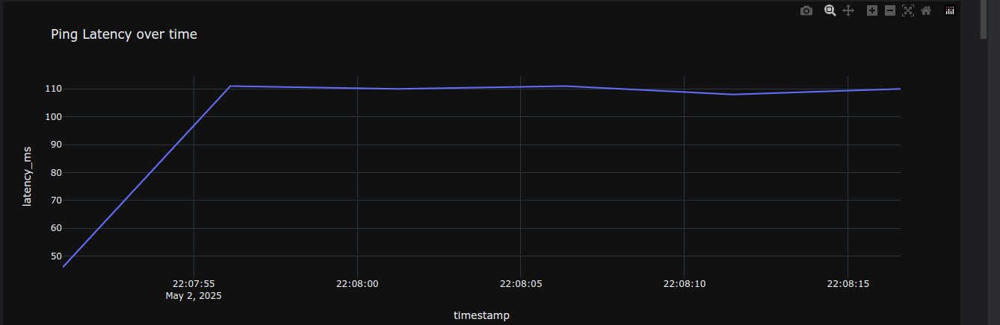
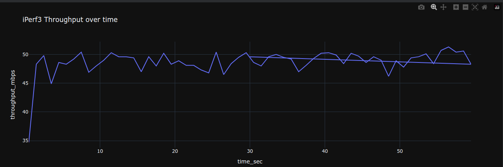
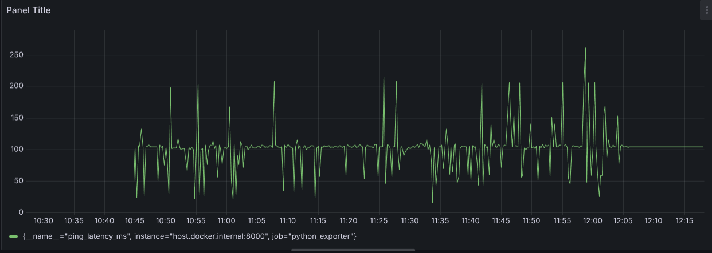

# Network Metrics Monitoring & Visualization Demo

## Project Goal
This project demonstrates a state-of-the-art pipeline for collecting, analyzing, and visualizing key network performance metrics latency, throughput, and packet loss.

- **iperf3** for traffic generation and throughput measurement
- **ping** (via Python subprocess) for ICMP-based latency measurements
- **Python** (`pandas`, `plotly`) for offline data analysis and interactive plotting
- **Prometheus** + **Grafana** for real-time metrics scraping and live dashboards

The end-to-end solution showcases both scripted data collection and rich visual insights, aligning with modern observability practices.

---
## Structure
- `scripts/` – Python scripts for data collection and exporting metrics
- `data/` – Raw data files (CSV)
- `notebooks/` – Jupyter Notebooks for analysis & visualization
- `docker-compose.yml` – Setup for Prometheus & Grafana

---

## How to Run

### 1. Clone the Repository

```
git clone git@github.com:Jiso-Chacko/network-metrics-demo.git
cd network-metrics-demo
```

### 2. Prepare the Environment
```aiignore
pip install -r requirements.txt
```

### 3. Collect Metrics
- **Latency (Ping):**
```aiignore
python scripts/collect_ping.py
```
- **Throughput (iPerf3):**
1. Start the server:
```aiignore
iperf3 -s
```
2. Run the client and save output:
```aiignore
iperf3 -c 127.0.0.1 -t 60 -i 1 > data/iperf_output.txt
```
3. Parse the results:
```aiignore
python scripts/parse_iperf.py
```

### 4. Visualize with Jupyter Notebook
```aiignore
jupyter notebook notebooks/analysis.ipynb
```

### 5. Live Monitoring (Prometheus + Grafana)
**1. Start services:**
```aiignore
docker-compose up -d prometheus grafana
```
**2. Configure Grafana:**

- Access Grafana at ``http://localhost:3000`` (default ``admin/admin``).

- Add Prometheus data source pointing to ``http://prometheus:9090``.

### Screenshots

Figure 1: Interactive Plot of ICMP Latency (Plotly)


Figure 2: Network Throughput Visualization (iPerf3)


Figure 3: Prometheus & Grafana Dashboard

